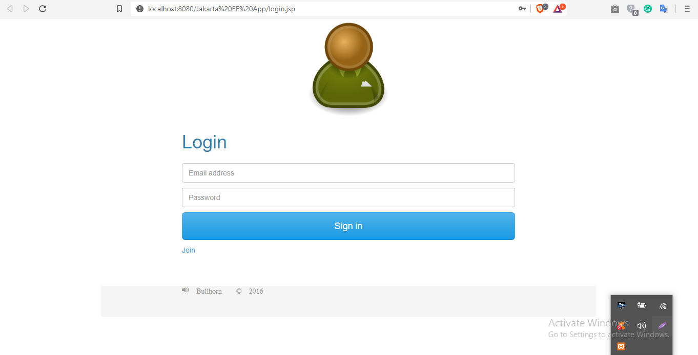
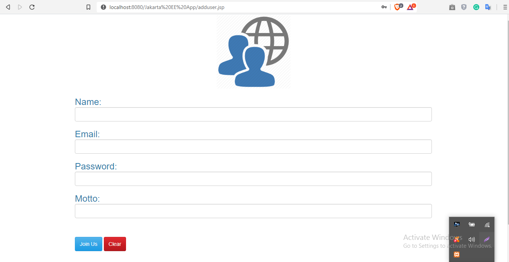
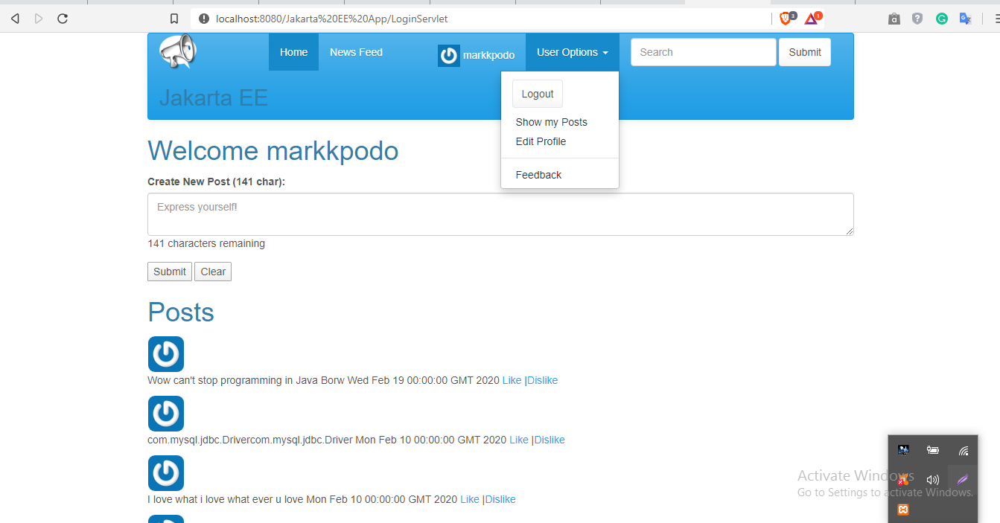

# Simple-Social-Media-App

The Simple-Social-Media-App contains web pages for login, home, news
feed, and user profile. The user starts at the login page. Once the user
clicks the Login button, the request (data from the login form) will be sent
to the login servlet
The login servlet will validate the user against the database. A
valid user will be stored in the session, which is the website’s way of
remembering data between page views. Invalid users will not get past the
login page until they enter a correct username and password combination.

